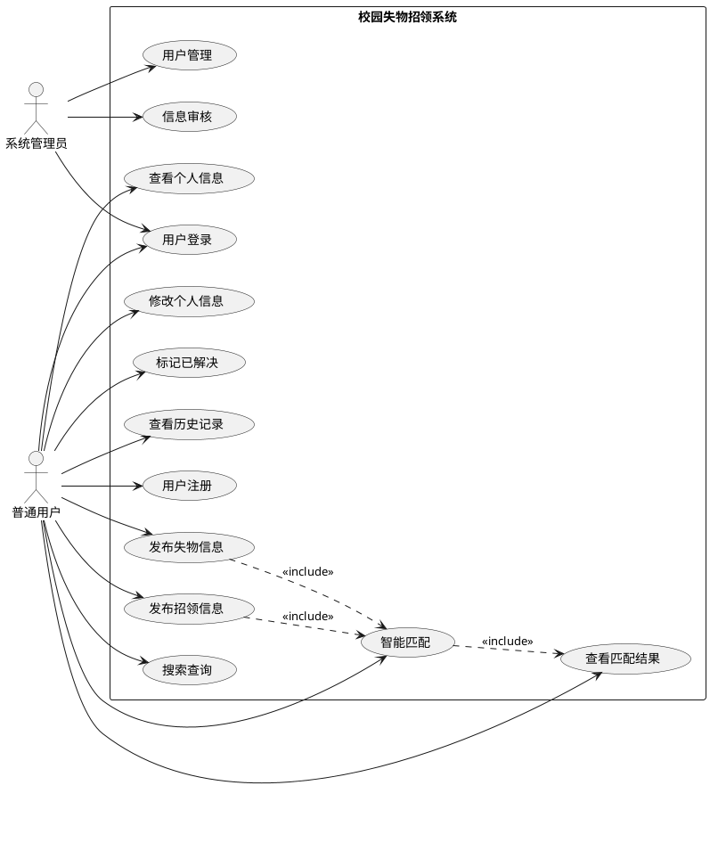
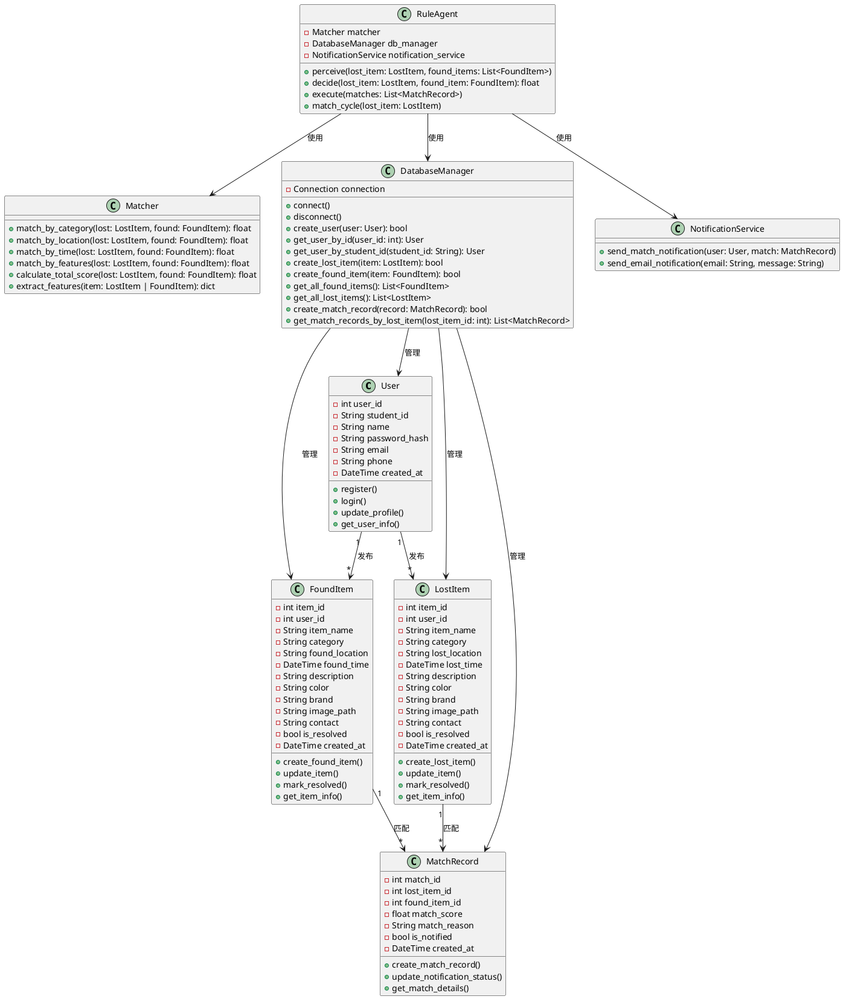
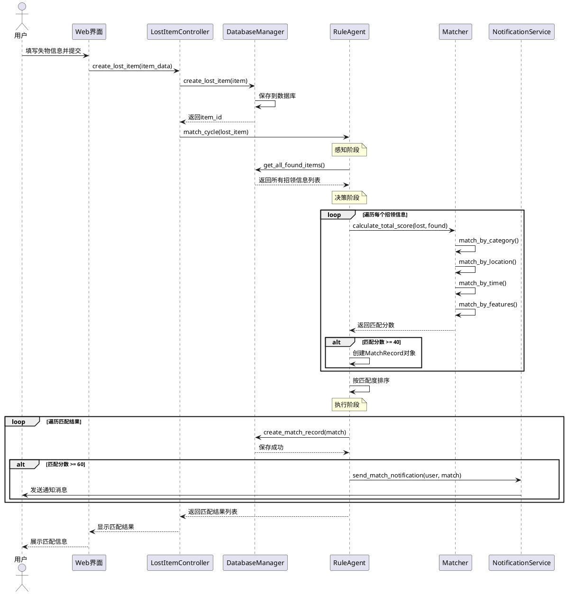
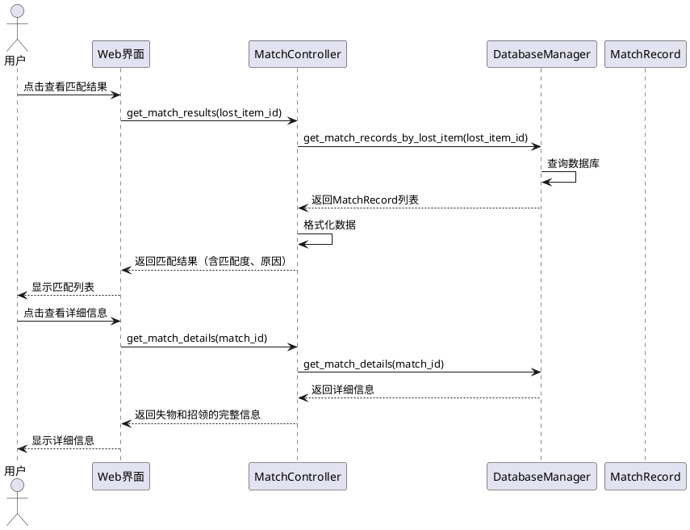
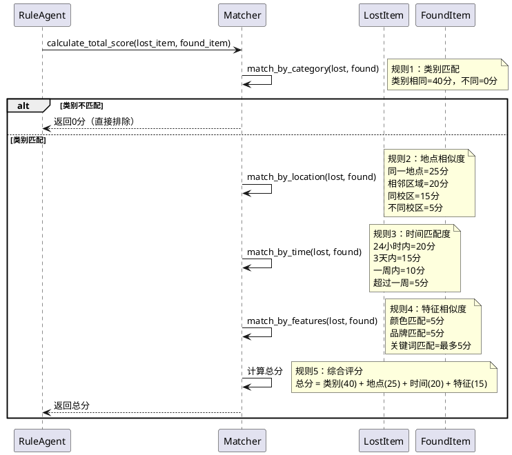

# UML 系统建模文档

## 一、用例图（Use Case Diagram）

### 1.1 用例图说明

系统主要参与者：
- **普通用户**：注册用户，可以发布失物/招领信息
- **系统管理员**：管理用户、审核信息
- **智能体系统**：自动匹配失物与招领信息

主要用例：
1. 用户注册/登录
2. 发布失物信息
3. 发布招领信息
4. 智能匹配（智能体）
5. 查看匹配结果
6. 搜索查询
7. 个人信息管理
8. 标记已解决

### 1.2 用例图（PlantUML格式）



### 1.3 用例详细描述

#### UC1: 用户注册
- **参与者**：普通用户
- **前置条件**：无
- **后置条件**：用户账号创建成功
- **基本流程**：
  1. 用户输入学号、姓名、密码、联系方式
  2. 系统验证信息格式
  3. 检查学号是否已注册
  4. 创建用户账号
  5. 返回注册成功

#### UC2: 用户登录
- **参与者**：普通用户、系统管理员
- **前置条件**：用户已注册
- **后置条件**：用户登录成功，获得访问权限
- **基本流程**：
  1. 用户输入学号和密码
  2. 系统验证账号密码
  3. 创建会话
  4. 跳转到主页

#### UC3: 发布失物信息
- **参与者**：普通用户
- **前置条件**：用户已登录
- **后置条件**：失物信息保存到数据库，触发智能匹配
- **基本流程**：
  1. 用户填写失物信息（名称、类别、地点、时间、特征描述）
  2. 可选上传图片
  3. 系统保存信息
  4. 触发智能匹配用例

#### UC4: 发布招领信息
- **参与者**：普通用户
- **前置条件**：用户已登录
- **后置条件**：招领信息保存到数据库，触发智能匹配
- **基本流程**：
  1. 用户填写招领信息（名称、类别、地点、时间、特征描述）
  2. 可选上传图片
  3. 系统保存信息
  4. 触发智能匹配用例

#### UC5: 智能匹配（核心用例）
- **参与者**：智能体系统
- **前置条件**：有新的失物或招领信息发布
- **后置条件**：生成匹配结果列表
- **基本流程**：
  1. 智能体感知：读取新发布的信息
  2. 从数据库获取所有相关记录
  3. 提取特征（类别、地点、时间、颜色等）
  4. 应用匹配规则：
     - 规则1：类别匹配
     - 规则2：地点相似度
     - 规则3：时间匹配度
     - 规则4：特征相似度
     - 规则5：综合评分
  5. 生成匹配结果（按匹配度排序）
  6. 保存匹配记录
  7. 发送通知（可选）

---

## 二、类图（Class Diagram）

### 2.1 类图说明

系统核心类：
1. **User（用户类）**：用户信息管理
2. **LostItem（失物类）**：失物信息
3. **FoundItem（招领类）**：招领信息
4. **MatchRecord（匹配记录类）**：匹配结果记录
5. **RuleAgent（规则智能体类）**：核心智能体
6. **Matcher（匹配引擎类）**：匹配算法实现
7. **DatabaseManager（数据库管理类）**：数据库操作
8. **NotificationService（通知服务类）**：消息通知

### 2.2 类图（PlantUML格式）



### 2.3 核心类详细设计

#### 2.3.1 User类
```python
class User:
    """用户类 - 管理用户信息"""
    def __init__(self, student_id, name, password, email, phone):
        self.user_id = None
        self.student_id = student_id
        self.name = name
        self.password_hash = self._hash_password(password)
        self.email = email
        self.phone = phone
        self.created_at = datetime.now()
    
    def register(self):
        """注册新用户"""
        pass
    
    def login(self, password):
        """用户登录验证"""
        pass
    
    def update_profile(self, **kwargs):
        """更新个人信息"""
        pass
```

#### 2.3.2 LostItem类
```python
class LostItem:
    """失物类 - 失物信息"""
    def __init__(self, user_id, item_name, category, 
                 lost_location, lost_time, description, 
                 color=None, brand=None, image_path=None):
        self.item_id = None
        self.user_id = user_id
        self.item_name = item_name
        self.category = category
        self.lost_location = lost_location
        self.lost_time = lost_time
        self.description = description
        self.color = color
        self.brand = brand
        self.image_path = image_path
        self.is_resolved = False
        self.created_at = datetime.now()
    
    def create_lost_item(self):
        """创建失物记录"""
        pass
    
    def mark_resolved(self):
        """标记为已解决"""
        self.is_resolved = True
```

#### 2.3.3 RuleAgent类（核心智能体）
```python
class RuleAgent:
    """规则型智能体 - 实现感知-决策-执行循环"""
    def __init__(self):
        self.matcher = Matcher()
        self.db_manager = DatabaseManager()
        self.notification_service = NotificationService()
    
    def perceive(self, lost_item, found_items):
        """感知阶段：获取环境信息"""
        # 从数据库获取所有招领信息
        # 提取特征
        features = self.matcher.extract_features(lost_item)
        return found_items, features
    
    def decide(self, lost_item, found_item):
        """决策阶段：应用匹配规则"""
        score = self.matcher.calculate_total_score(lost_item, found_item)
        return score
    
    def execute(self, matches):
        """执行阶段：保存结果并发送通知"""
        for match in matches:
            self.db_manager.create_match_record(match)
            if match.match_score >= 60:
                # 发送高匹配度通知
                user = self.db_manager.get_user_by_id(match.lost_item.user_id)
                self.notification_service.send_match_notification(user, match)
    
    def match_cycle(self, lost_item):
        """完整的感知-决策-执行循环"""
        # 感知
        found_items, features = self.perceive(lost_item, None)
        
        # 决策
        matches = []
        for found_item in found_items:
            score = self.decide(lost_item, found_item)
            if score >= 40:  # 最低匹配阈值
                match = MatchRecord(
                    lost_item_id=lost_item.item_id,
                    found_item_id=found_item.item_id,
                    match_score=score,
                    match_reason=self._generate_reason(lost_item, found_item, score)
                )
                matches.append(match)
        
        # 按匹配度排序
        matches.sort(key=lambda x: x.match_score, reverse=True)
        
        # 执行
        self.execute(matches)
        
        return matches
```

#### 2.3.4 Matcher类（匹配引擎）
```python
class Matcher:
    """匹配引擎 - 实现各种匹配规则"""
    
    def match_by_category(self, lost, found):
        """规则1：类别匹配（40分）"""
        if lost.category == found.category:
            return 40.0
        return 0.0
    
    def match_by_location(self, lost, found):
        """规则2：地点相似度（25分）"""
        # 地点匹配逻辑
        if lost.lost_location == found.found_location:
            return 25.0
        elif self._is_nearby(lost.lost_location, found.found_location):
            return 20.0
        elif self._is_same_campus(lost.lost_location, found.found_location):
            return 15.0
        else:
            return 5.0
    
    def match_by_time(self, lost, found):
        """规则3：时间匹配度（20分）"""
        time_diff = abs((found.found_time - lost.lost_time).total_seconds() / 3600)
        if time_diff <= 24:
            return 20.0
        elif time_diff <= 72:
            return 15.0
        elif time_diff <= 168:
            return 10.0
        else:
            return 5.0
    
    def match_by_features(self, lost, found):
        """规则4：特征相似度（15分）"""
        score = 0.0
        # 颜色匹配（5分）
        if lost.color and found.color and lost.color == found.color:
            score += 5.0
        # 品牌匹配（5分）
        if lost.brand and found.brand and lost.brand == found.brand:
            score += 5.0
        # 描述关键词匹配（最多5分）
        score += self._keyword_match(lost.description, found.description, max_score=5.0)
        return min(score, 15.0)
    
    def calculate_total_score(self, lost, found):
        """规则5：综合评分"""
        category_score = self.match_by_category(lost, found)
        if category_score == 0:  # 类别不匹配，直接返回0
            return 0.0
        
        location_score = self.match_by_location(lost, found)
        time_score = self.match_by_time(lost, found)
        feature_score = self.match_by_features(lost, found)
        
        total = category_score + location_score + time_score + feature_score
        return total
```

---

## 三、顺序图（Sequence Diagram）

### 3.1 用户发布失物信息并触发智能匹配（核心流程）



### 3.2 用户查看匹配结果流程



### 3.3 智能体匹配决策详细流程



---

## 四、UML建模总结

### 4.1 用例图总结
- **参与者**：2个（普通用户、系统管理员）
- **用例**：13个核心用例
- **关系**：包含关系（发布信息包含智能匹配）

### 4.2 类图总结
- **核心类**：8个主要类
- **关系类型**：
  - 关联关系：User与LostItem/FoundItem（一对多）
  - 组合关系：RuleAgent包含Matcher、DatabaseManager、NotificationService
  - 依赖关系：各类依赖DatabaseManager进行数据操作

### 4.3 顺序图总结
- **核心流程**：3个主要顺序图
  1. 发布失物并触发智能匹配（展示完整的感知-决策-执行循环）
  2. 查看匹配结果
  3. 智能体决策详细流程

### 4.4 智能体设计验证
✅ **感知阶段**：从数据库获取环境信息（失物/招领记录）  
✅ **决策阶段**：应用5种匹配规则（≥3种决策分支，满足要求）  
✅ **执行阶段**：保存结果、发送通知、更新状态  

---

## 五、下一步工作

1. ✅ **UML建模完成**（当前步骤）
2. ⏭️ **数据库详细设计**（ER图、表结构、索引设计）
3. ⏭️ **智能体算法详细实现**
4. ⏭️ **编码实现**

---

## 附录：PlantUML使用说明

1. 在线工具：http://www.plantuml.com/plantuml/uml/
2. VS Code插件：PlantUML
3. 导出格式：PNG、SVG、PDF

